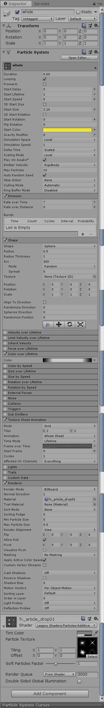
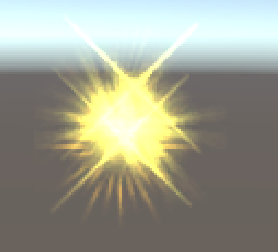
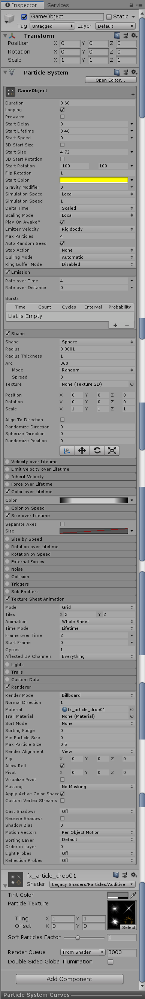
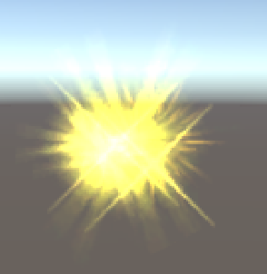
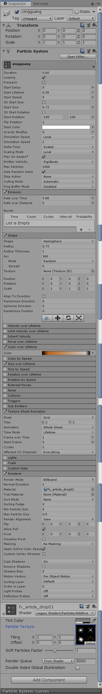
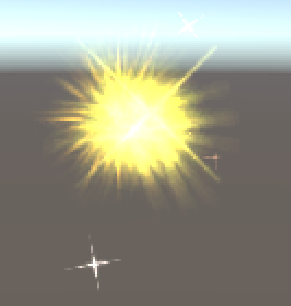
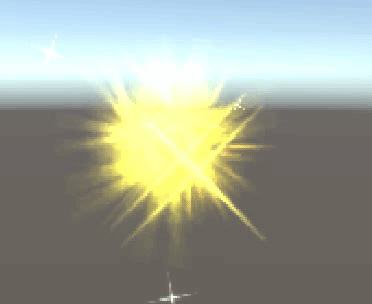
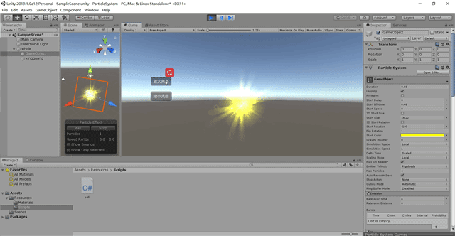

# 简单粒子制作

github完整工程文件

游戏视频<https://www.bilibili.com/video/av74717368/>

## 简单的粒子系统

参照<https://www.cnblogs.com/CaomaoUnity3d/p/5983730.html>，我制作了一个有光晕的美丽的魔法球。

首先创建一个空对象，并增加组件Particle System，调整相应的参数使之作为魔法球的发光主体。参照博客，把粒子的Speed设置为0，然后粒子的Shape我们可以设置为Sphere，因为我们主要的目的是让光晕填充完这个粒子，显的饱满。



得到了如下的效果：



可以看出已经做好了魔法球的主体——一个较为饱满而明亮的球。

下面需要给魔法球添加光晕效果。在空物体上添加子部件Particle System，用来制作光晕效果。



得到的效果如下图所示：



可以看出，魔法球已经有了非常美丽的光晕。

最后一步需要增加魔法球的星光闪烁效果，让魔法球更美丽。还是在原来的空物体上添加新的空物体，并挂载Particle System组件，增加星光效果。最后实现的效果是从球心向外发射“星星”。



发射的星星的效果如下图：



最后魔法球的效果如下图所示：




## 添加简单代码

增加代码使得光晕的大小可以被控制。

```c#
using System.Collections;
using System.Collections.Generic;
using UnityEngine;

public class ball : MonoBehaviour
{
    ParticleSystem particleSystem;
    float time;
    ParticleSystem exhaust;

    void Start()
    {
        time = 0;
        particleSystem = GetComponent<ParticleSystem>();
    }

    [System.Obsolete]
    void Update()
    {
    }

    [System.Obsolete]
    void OnGUI()
    {
        if (GUI.Button(new Rect(100, 150, 70, 30), "放大光晕"))
        {
            particleSystem.startSize = particleSystem.startSize + 0.5f;
        }

        if (GUI.Button(new Rect(100, 200, 70, 30), "缩小光晕"))
        {
            particleSystem.startSize = particleSystem.startSize - 0.5f;
        }

    }

}

```

